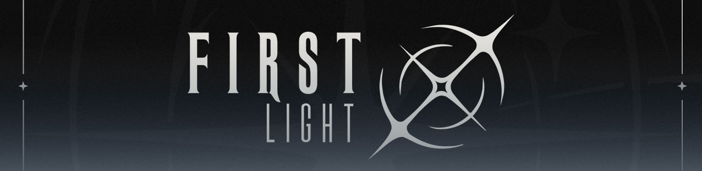

# UltimateGG First Light announcement and additional info

  

# Tournament and VRS info

- Tournament VRS Tier - VRS Tier 2 
- VRS publication date used for Seeding: October 2026
- Registration: first-come, first-served
- Entry Fee: 2000 USD

# Ranked Stages
- An official application will be submitted to HLTV.org for VRS inclusion. Please note that HLTV.org makes the final decision on which matches count towards the ranking.

# Tournament Format
Tournament contains following stages:

- Main Event Group Stage - 16  teams (Online - 27th of October - 28th of October - 4 GSL BO3 Groups. Best 2 teams from each group advance to the play-off stage)
- Main Event Play-off Stage - Best 8 teams from Main Event Group Stage (LAN - 29th of October - 31st of October - Single Elimination BO3 with 3rd place decider)
  
# Prize Pool

Total Prize Pool of Main event is 15 000 USD if 16 teams registred

| Place | Prize |
| --- | --- |
|1 st place | 8 000 USD |
| 2nd place | 4 000 USD |
| 3rd place | 2 000 USD |
| 4th place | 1 000 USD |

Total Prize Pool of Main event is 6 000 USD if 8 teams registred

| Place | Prize |
| --- | --- |
|1 st place | 3 000 USD |
| 2nd place | 1 500 USD |
| 3rd place | 1 000 USD |
| 4th place | 500 USD |

# Visa/Location

Location: Europe (Online) for online part of tournament, Moscow (Russia) for LAN part of tournament
- Please note that travel support/accommodation is not provided for LAN stage

# Main Event Rulebook

*Main event rulebook will be shared with teams no later than one week before event.*

# Disqualification and Technical Defeat Policy 

[Disqualification and Technical Defeat Policy](disqualification-and-technical-defeat-policy.md)

# Verifiability
- This Additional Information is published on a platform that preserves version history

# Important

- Registered teams will have 72 hours to complete the payment to secure their spot. If teams failed to complete payment in time, slot will be forwarded to the next registered team. 
- Registration deadline - 25th of October 2026
